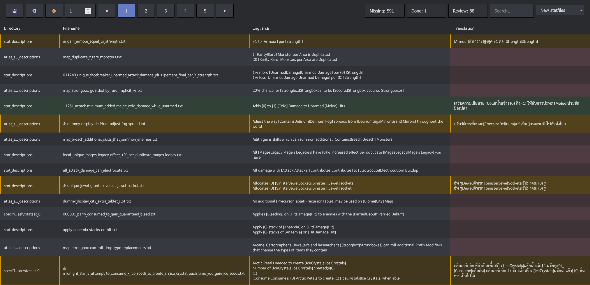
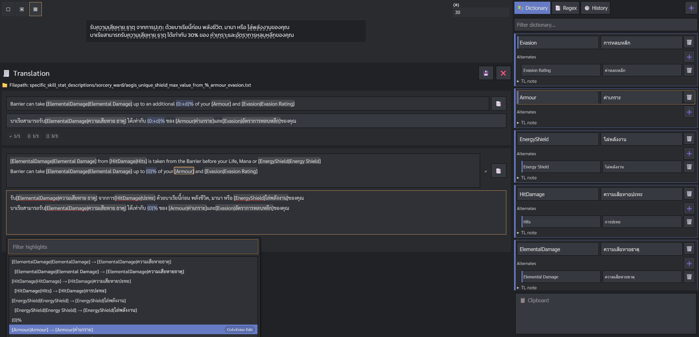
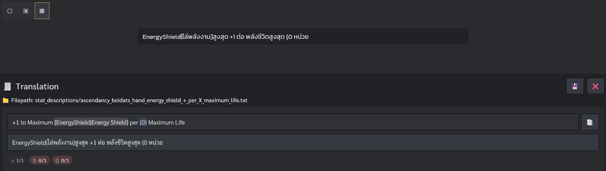
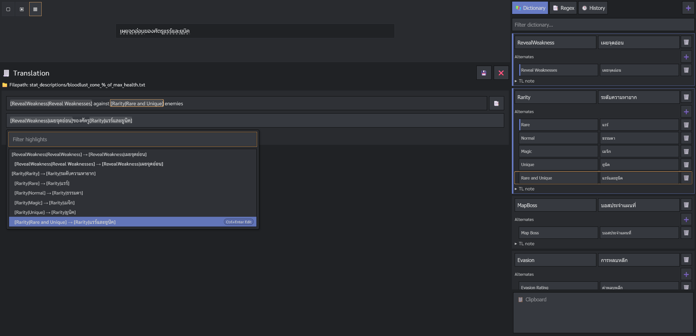

# SDEditor
*browser-based editor for `StatDescriptions.zip` (translation stat files).*
You can access the live version [here](<https://sdeditor.pages.dev/>), or if you prefer not to use online version you can clone the [repo](<https://github.com/peter-pakanun/SDEditor>) and run it locally. 
## How to use
[Full Editor Guide](#)
1) Open the [web app](<https://sdeditor.pages.dev/>) and pick your target language, theme, size
2) Import `StatDescriptions.zip`
3) Click any row to edit, then save
4) Click 💾 to export `StatDescriptions_Translated.zip` and submit your work
> Your in-progress edits are stored in your browser (`indexedDB`)
## Threads
:pencil: [Patch Notes](#)
:bug: [Bug Reports / Feature Requests](#)
## Keyboard shortcuts
- **Ctrl + Space:** during editing to open the autocomplete menu
  - **Autocomplete menu:** while it’s open, **Ctrl + Enter** will jump to/edit the matching Dictionary entry, or create one (and focus the right Replace field)
  - **When you’re done:** **Ctrl + Space** again to use the entry you just created, this will go back to the translation field
- **Ctrl + S:** save the current file
- **Ctrl + > and <:** save and move to the next/previous file, holding **Shift** key will skip saving
- **Ctrl + F:** focus on the search bar
- **Highlighted text**: in the source file there is a highlighted text that you can interact with
  - **Click:** on the highlighted text to paste it down, replacing the current selection
  - **Ctrl + Click:** on the highlighted text to jump to the Dictionary entry (or create it if it doesn't exist)
  - **Alt + Click:** on the highlighted text to copy it
  - **Alt + number:** paste the highlighted text down by the order number, replacing the current selection

